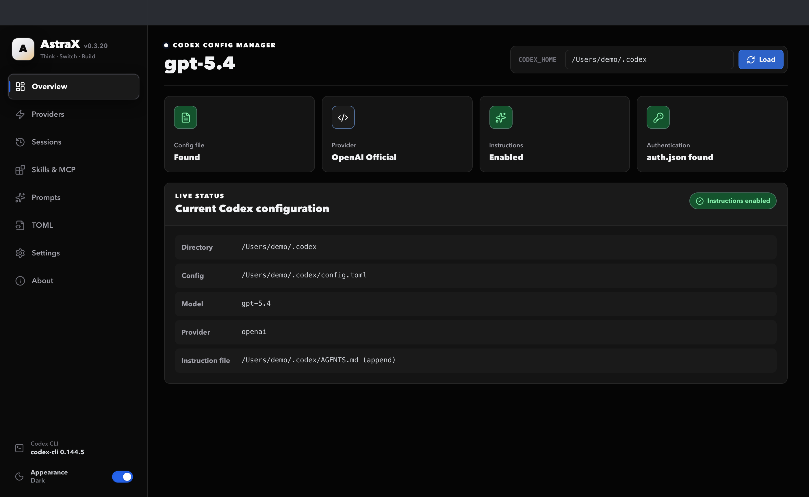
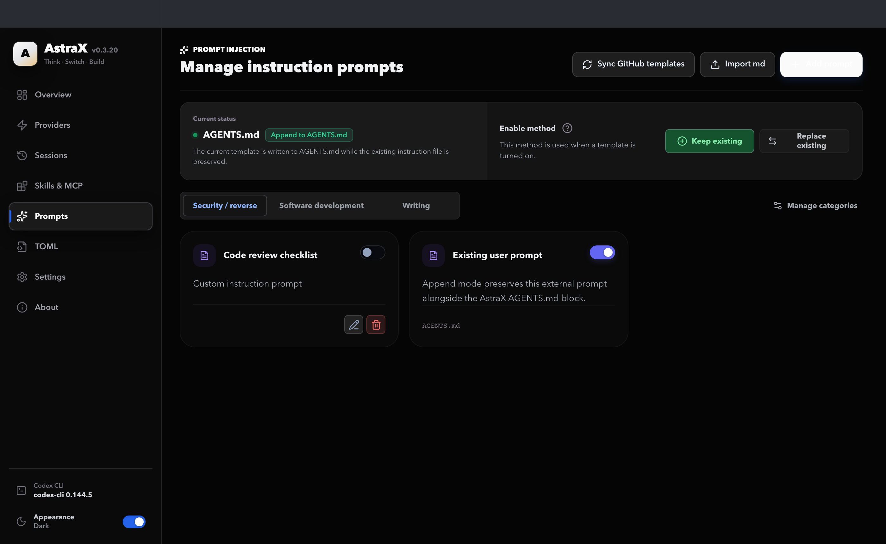
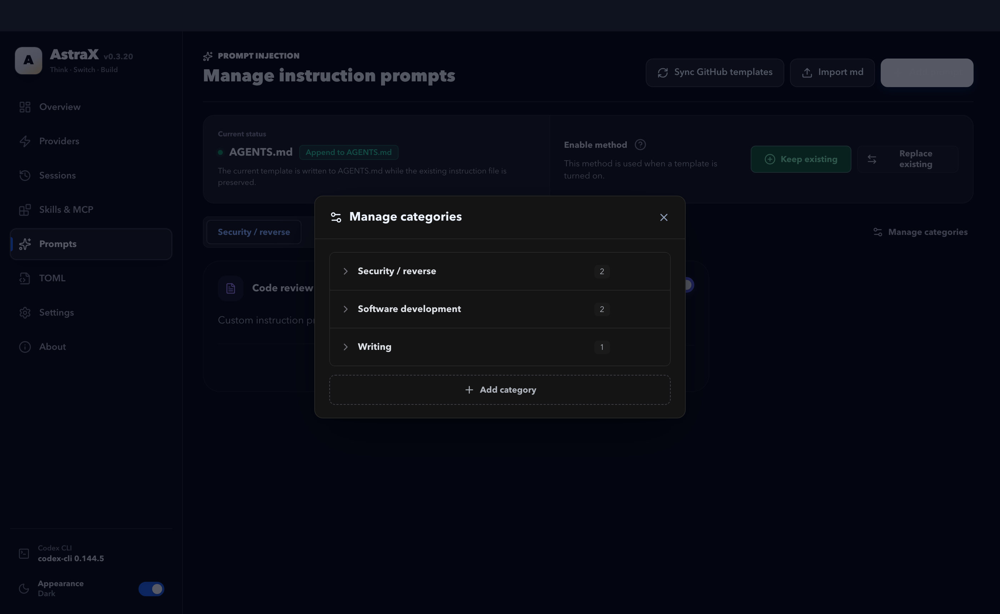
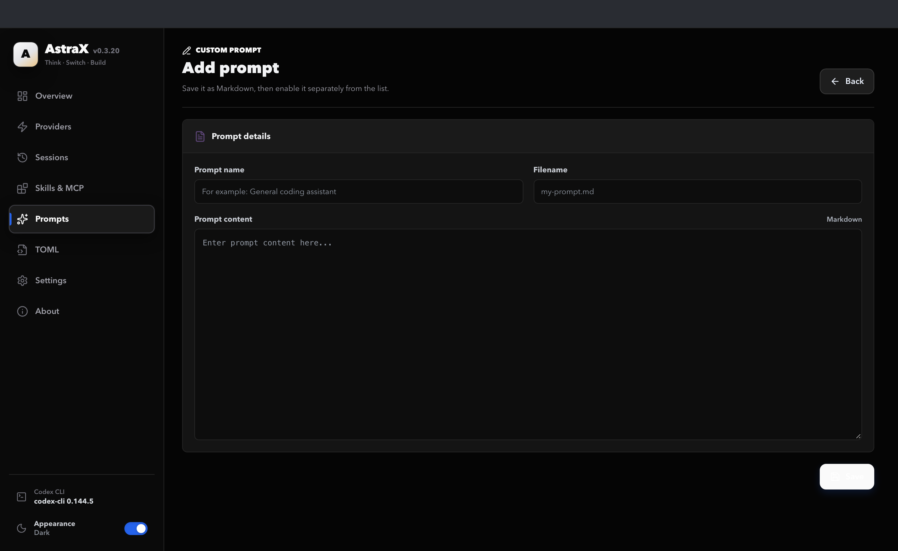
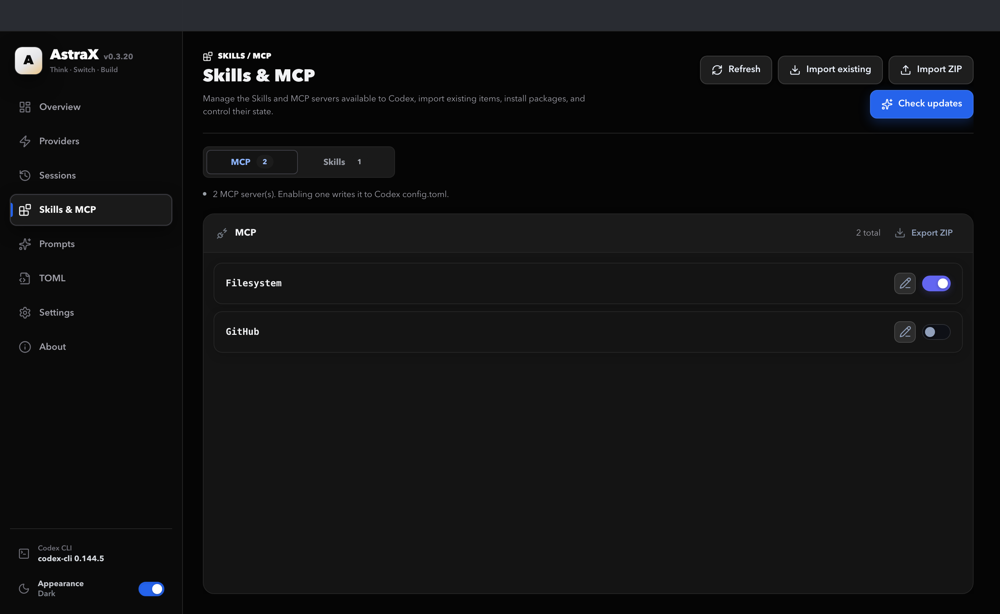

<p align="center">
  
</p>

<h1 align="center">AstraX</h1>

<p align="center">
  <b>Think · Switch · Build</b><br />
  A Grok-inspired desktop manager for <b>OpenAI Codex Desktop / Codex CLI</b>
</p>

<p align="center">
  Prompts · Providers · Sessions · Skills / MCP · TOML · Usage — in one dark, fast UI
</p>

<p align="center">
  <a href="https://github.com/alexbieber/AstraX/stargazers"></a>
  <a href="https://github.com/alexbieber/AstraX/network/members"></a>
  <a href="https://github.com/alexbieber/AstraX/issues"></a>
  <a href="LICENSE"></a>
</p>

<p align="center">
  
  
  
  
  
  
</p>

<p align="center">
  <a href="#-screenshots"><strong>Screenshots</strong></a> ·
  <a href="#-features"><strong>Features</strong></a> ·
  <a href="#-quick-start"><strong>Quick Start</strong></a> ·
  <a href="#-configuration-paths"><strong>Config Paths</strong></a> ·
  <a href="#-tech-stack"><strong>Tech Stack</strong></a>
</p>

---

## Screenshots

<details open>
<summary><b>Overview</b> — home dashboard, provider status, and quick actions</summary>
<p align="center">
  
</p>
</details>

<details open>
<summary><b>Prompt center</b> — templates, sync, import, enable / disable</summary>
<p align="center">
  
</p>
</details>

<table>
  <tr>
    <td align="center" width="50%">
      <b>Categories</b><br />
      <sub>Organize prompts by workflow</sub><br />
      
    </td>
    <td align="center" width="50%">
      <b>Custom prompts</b><br />
      <sub>Add or import Markdown templates</sub><br />
      
    </td>
  </tr>
  <tr>
    <td align="center" colspan="2">
      <b>Skills &amp; MCP</b><br />
      <sub>Enable, disable, and import capability extensions</sub><br />
      
    </td>
  </tr>
</table>

---

## Why AstraX?

Codex Desktop, Codex CLI, third-party APIs, prompt files, Skills, and MCP configs scatter across folders and TOML. **AstraX** puts the high-frequency work in one desktop app with a near-black, Grok-like interface — so you see state clearly and switch with one click.

| You want to… | AstraX lets you… |
| --- | --- |
| Switch providers fast | Save named official Codex logins + third-party APIs, duplicate, test, and hot-switch |
| Manage prompts like plugins | Import `.md`, sync templates, append or replace, enable/disable with backups |
| Clean up sessions | Search by project, repair mismatches, multi-select delete (including child sessions) |
| Control Skills & MCP | Import, ZIP-install Skills, enable/disable servers without hand-editing config |
| Inspect live config | View/edit `config.toml` and `auth.json` with automatic backups before writes |
| Track usage | Token trends by date and model; subagent usage rolls into the parent session |

---

## Features

### Prompt center
- Built-in template library + GitHub sync + local cache for offline use  
- Custom prompts: create, import Markdown, categorize, edit, delete  
- **Keep existing** (append managed block) or **Replace existing** modes  
- Automatic backup before every enable / disable  

### Provider / API switching
- Multiple official Codex login profiles alongside third-party providers  
- Connection checks, model discovery, Wire API / Base URL / Key editing  
- Import from **cc-switch**; skip duplicates by URL + key  
- Optional local routing / failover for resilient provider switching  

### Sessions
- Search and group by project path  
- Inspect / repair provider mismatches  
- Precise permanent delete (single, multi, or whole project)  

### Skills & MCP
- Visual inventory of Skills and MCP servers  
- Import existing configs or install Skills from ZIP  
- Per-item enable / disable with config sync  

### Config, auth & usage
- Live `config.toml` preview with syntax highlighting  
- Official auth vs third-party API keys in one place  
- Usage statistics: daily trends, cache hit rate, model mix  

### Cross-platform
- macOS (Apple Silicon & Intel), Windows (MSI / portable), Linux packages  
- Built with **Tauri 2** for a small, native feel  

---

## Quick Start

### Requirements
- **Node.js** 20+ and **pnpm**
- **Rust** (stable) for desktop builds
- OpenAI **Codex Desktop** and/or **Codex CLI** installed

### Install & run (dev)

```bash
git clone https://github.com/alexbieber/AstraX.git
cd AstraX
pnpm install
pnpm dev
```

### Build desktop installers

```bash
pnpm build
# or
pnpm --dir apps/desktop tauri build
```

### macOS Gatekeeper note
Unsigned local builds may show “app is damaged.” For local testing only:

```bash
xattr -dr com.apple.quarantine /Applications/AstraX.app
```

---

## Configuration Paths

AstraX reads the Codex home by default:

```text
~/.codex/config.toml
~/.codex/auth.json
```

Environment overrides:

```text
CODEX_HOME=/path/to/.codex
CODEXX_HOME=/path/to/astra-data
CC_SWITCH_HOME=/path/to/.cc-switch
```

AstraX app database (default):

```text
~/.codexx/codexx.db
```

---

## Tech Stack

| Layer | Stack |
| --- | --- |
| Desktop | Tauri 2 |
| UI | React 18 · TypeScript · Vite |
| Backend | Rust |
| Data | SQLite (rusqlite) |
| Config | TOML · JSON |
| Release | GitHub Actions / Releases |

---

## Project Layout

```text
AstraX/
├── apps/desktop/          # Tauri + React app
│   ├── src/               # UI
│   └── src-tauri/         # Rust backend
├── examples/              # Prompt templates
├── docs/                  # Docs & screenshots
├── scripts/               # Helper scripts
└── package.json           # Workspace scripts
```

---

## Roadmap

- [ ] In-app update channel for AstraX releases  
- [ ] More provider presets and first-run onboarding  
- [x] Screenshot gallery for README previews  
- [ ] Optional light theme polish to match the dark brand  
- [ ] Fresh AstraX-branded screenshot set (English UI)  

Contributions welcome — open an issue or PR on [alexbieber/AstraX](https://github.com/alexbieber/AstraX).

---

## Attribution

AstraX is a branded fork of [Codex-X](https://github.com/yynxxxxx/Codex-X) (MIT), with a Grok-inspired dark theme and English-first UI.  
See `LICENSE` and `THIRD_PARTY_NOTICES.md` for full credits (including CC Switch routing inspiration).

---

## License

[MIT](LICENSE) — free to use, modify, and distribute with attribution.

---

<p align="center">
  <b>AstraX</b> — Think · Switch · Build<br />
  <sub>If this helps your Codex workflow, star the repo — it keeps the project visible.</sub>
</p>
